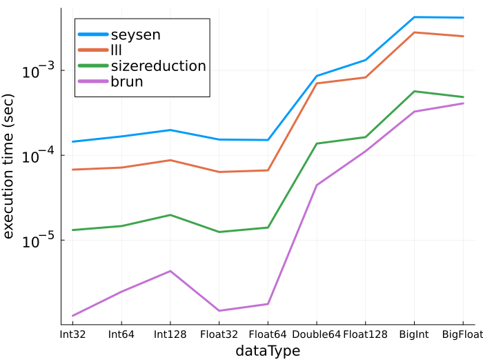

# LLLplus.jl

[](https://travis-ci.org/christianpeel/LLLplus.jl)
[](https://christianpeel.github.io/LLLplus.jl/dev)

LLLplus provides
[Lenstra-Lenstra-Lovász](https://en.wikipedia.org/wiki/Lenstra%E2%80%93Lenstra%E2%80%93Lov%C3%A1sz_lattice_basis_reduction_algorithm)
(LLL) lattice reduction, solvers for the
[shortest vector problem](https://en.wikipedia.org/wiki/Lattice_problem#Shortest_vector_problem_(SVP))
(SVP) and the [closest vector problem](https://en.wikipedia.org/wiki/Lattice_problem#Closest_vector_problem_.28CVP.29)
(CVP), and related algorithms. These tools are
used in cryptography, digital communication, and integer programming.
This package is experimental and not a robust tool; use at your own
risk :-)

LLL lattice reduction is a powerful tool that is widely used in
cryptanalysis, in cryptographic system design, in digital
communications, and to solve other integer problems. The historical
and practical prominence of the LLL technique in lattice tools is the
reason for its use in the name "LLLplus". LLL reduction is often used
as an approximate solution to the SVP.  We also include
[Brun](https://archive.org/stream/skrifterutgitavv201chri#page/300/mode/2up)
integer relations,
[Seysen](http://link.springer.com/article/10.1007%2FBF01202355)
lattice reduction, and
[Hermite-Korkine-Zolotarev](http://www.cas.mcmaster.ca/~qiao/publications/ZQW11.pdf)
lattice reduction techniques.

One application of lattice tools is in cryptanalysis; as an demo of a
cryptanalytic attack, see the `subsetsum` function.  The LLL algorithm
has been shown to solve many integer programming feasibility problems;
see `integerfeasibility` for a demo. Lattice tools are often used to
study and solve Diophantine problems; for example in "simultaneous
diophantine approximation" a vector of real numbers are approximated
by rationals with a common deonminator. For a demo function, see
`rationalapprox`.  The
[MUMIMO.jl](https://github.com/christianpeel/MUMIMO.jl) package
demostrates how the `cvp`, `lll`, `brun`, `seysen`, and
[`vblast`](https://en.wikipedia.org/wiki/Bell_Laboratories_Layered_Space-Time)
functions can be used to solve (exactly or approximately) CVP problems
and thereby decode multi-antenna signals.
Finally, to see how the LLL can be used to find spigot formulas for
irrationals, see `spigotBBP`.


<details>
   <summary><b>Examples</b> (click for details)</summary>
<p>

Each function contains documentation and examples available via Julia's
built-in documentation system, for example with `?lll`. Documentation
for all functions is [available](https://christianpeel.github.io/LLLplus.jl/dev). A tutorial notebook is
found in the [`docs`](docs/LLLplusTutorial.ipynb) directory or on
[nbviewer](https://nbviewer.jupyter.org/github/christianpeel/LLLplus.jl/blob/master/docs/LLLplusTutorial.ipynb).

Here are a few examples of using the functions in the
package on random lattices.

```julia
Pkg.add("LLLplus")
using LLLplus

# do lattice reduction on a matrix with randn entries
N = 100;
H = randn(N,N);
B,T = brun(H);
B,T = lll(H);
B,T = seysen(H);

# check out the CVP solver
Q,R=qr(H);
u=Int.(rand(0:1e10,N));
y=H*u+rand(N)/100;
uhat=cvp(Q'*y,R);
sum(abs.(u-uhat))
```
</p>
</details>

<details>
   <summary><b>Execution Time results</b> (click for details)</summary>
<p>

In the first test we compare the `lll` function from LLLplus, the
`l2avx` function in the `src\l2.jl` file in LLLplus, the
`lll_with_transform` function from Nemo (which uses FLINT), and the
`lll_reduction` function from fplll. Nemo and fplll are written by
number theorists and are good benchmarks against which to compare.  We
first show how the execution time varies as the basis (matrix) size
varies over [4 8 16 32 64]. For each matrix size, 20 random bases
are generated using fplll's `gen_qary` function with depth of 25
bits, with the average execution time shown; the `eltype` is `Int64`
except for NEMO, which uses GMP (its own `BigInt`); in all cases the
`δ=.99`. The vertical axis shows
execution time on a logarithmic scale; the x-axis is also
logarithmic. The generally linear nature of the LLL curves supports
the polynomial-time nature of the algorithm. The `LLLplus.lll`
function is slower, while `l2avx` is similar to fplll. Though not
shown, using bases from `gen_qary` with bit depth of 45 gives fplll
a larger advantage. This figure was generated using code in
`test/timeLLLs.jl`.


One question that could arise when looking at the plot above is what
the quality of the basis is. In the next plot we show execution time
vs the norm of the first vector in the reduced basis, this first
vector is typically the smallest; its norm is an rough indication of
the quality of the reduced basis. We show results averaged over 20
random bases from `gen_qary` with depth `25` bits, this time with the
dimension fixed at `32`. The curve is created by varying the `δ`
parameter from `.29` to `.99` in steps of `.2`; the larger times and
smaller norms correspond to the largest `δ` values. Though the `l2avx`
function is competitive with fplll in this case, in most cases
the fplll code is faster.


Finally, we show execution time for several built-in
datatypes (Int32, Int64, Int128, Float32, Float64, BitInt, and
BigFloat) as well as type from external packages (Float128 from
[Quadmath.jl](https://github.com/JuliaMath/Quadmath.jl) and Double64
from [DoubleFloat.jl](https://github.com/JuliaMath/DoubleFloats.jl))
which are used to 
generate 60 16x16 matrices, over which execution time for the
lattice reduction techniques is averaged.  The vertical axis is a
logarithmic representation of execution time as in the previous
figure. This figure was generated using code in `test/perftest.jl`.



</p>
</details>

<details>
   <summary><b>Notes</b> (click for details)</summary>
<p>

The algorithm pseudocode in a [survey paper by Wuebben](http://www.ant.uni-bremen.de/sixcms/media.php/102/10740/SPM_2011_Wuebben.pdf) and the
[monograph by Bremner](https://www.amazon.com/Lattice-Basis-Reduction-Introduction-Applications/dp/1439807027) 
were helpful in writing the lattice reduction tools in LLLplus
and are a good resource for further study. If you are trying to break
one of the [Lattice Challenge](http://www.latticechallenge.org)
records or are looking for robust, well-proven lattice tools, look at
[fplll](https://github.com/fplll/fplll). Also, for many
number-theoretic problems the
[Nemo.jl](https://github.com/Nemocas/Nemo.jl) package is appropriate;
it uses the [FLINT](http://flintlib.org/) C library to do LLL
reduction on Nemo-specific data types.  Finally, no number theorists
have worked on LLLplus; please treat the package as experimental.
